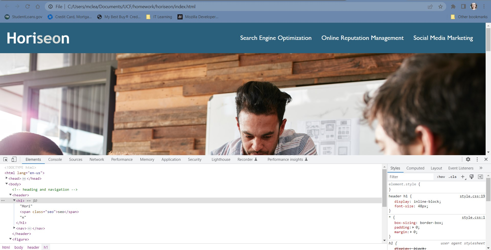

# horiseon

## Description

This project was built to refactor the HTML and CSS for the Horiseon webpage. The HTML was enhanced for search engine optimization and accessibility through semantic HTML tags. The CSS was updated to include the semantic HTML tags and was cleaned up to remove unnecessary selectors. CSS selectors were also combined when possible.

I learned how to make HTML and CSS files easier to read and learned how to incorporate semantic HTML for SEO and accessibility purposes.

## Usage

Use Chrome Developer Tools to inspect the page. Open the webpage in the Google Chrome browser, right click on the page, and select 'inspect.' View semantic HTML and consolidated CSS selectors.

To add a screenshot, create an `assets/images` folder in your repository and upload your screenshot to it. Then, using the relative filepath, add it to your README using the following syntax:

    ```md
    
    ```

## Credits

Thank you to my classmates for all the support!


